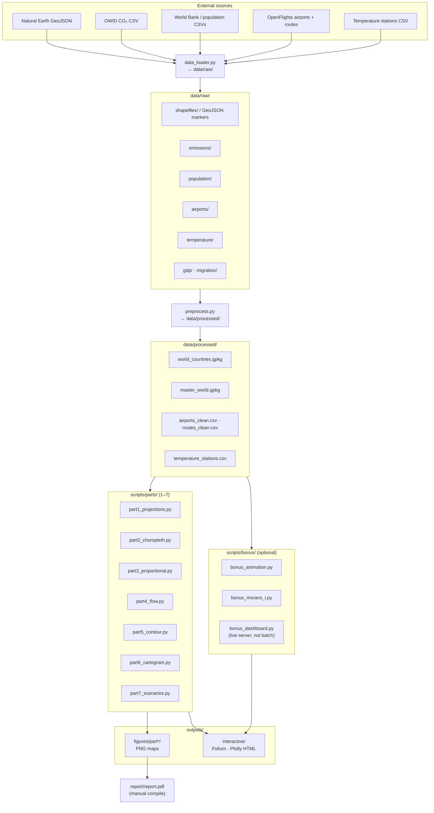

# Workflow — GeoMetric

End-to-end flow from downloads to figures and optional bonus HTML exports. Configuration lives in `scripts/utils/config.py`; do not hardcode paths or DPI in part scripts.

## Data flow (Mermaid)

The diagram below renders on GitHub (and in most Markdown viewers that support Mermaid).



## Orchestration

| Command | Purpose |
|--------|---------|
| `python scripts/utils/data_loader.py` | Download raw files |
| `python scripts/utils/preprocess.py` | Build `data/processed/` |
| `python run_all.py` | Full pipeline (parts 1–7) |
| `python run_all.py --draft` | Same, 150 DPI |
| `python run_all.py --skip-download --skip-preprocess` | Regenerate figures only |
| `python run_all.py --bonus --skip-download --skip-preprocess` | Batch bonus HTML only (animation + Moran) |
| `make` | See `Makefile` for venv-based shortcuts |

## Config system

- **PATHS** — directories and output roots  
- **PROJECTIONS** — CRS strings for all maps  
- **STYLE** — figure size, DPI, palettes  
- **DATASETS** — download URLs  

Use `map_utils.save_figure()` and `map_utils.reproject_gdf()` consistently.

## Testing

```bash
pytest tests/ -v
```

## Conventions

- Static maps: `outputs/figures/partN_*/` at 300 DPI (`save_figure`, final mode).  
- Interactive: `outputs/interactive/` (Folium / Plotly `write_html`).  
- Dash app (`bonus_dashboard.py`) runs interactively; it is not invoked by `run_all.py` (no blocking server).
